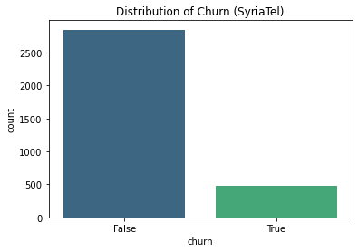
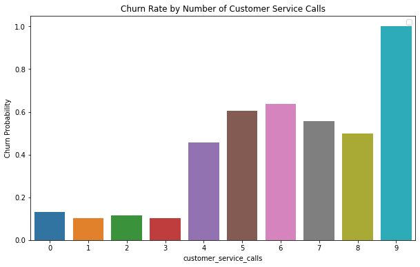
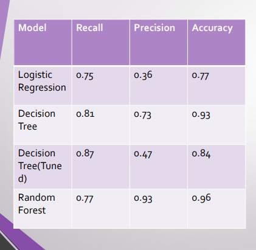
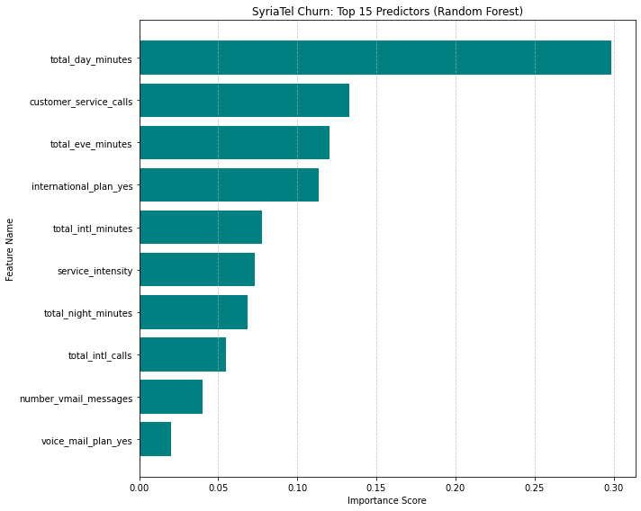

# SYRIATEL CUSTOMER CHURN ANALYSIS  
## Overview  
This project is addressing a major business challenge of Customer Churn at SyriaTel. Since 2000, the Company has been the leading Syrian mobile telecommunication. However, there has been an increased competition in the Syrian Telecommunication market. This has raised a major concern to the management and hence demanding an anlysis of the root causes of teh increased customer churn in the company.  
##  Business Understanding 
With the Increased competition in the Syrian mobile telecommunication market, SyriaTel needs to strategically address customer challenges to remain competitive within the market.   
SyrialTel has identified an increased customer churn rate which has led in declined sale revenue and brand loyalty.  
This project will develop a data-driven strategy to mitigate the risks of customer churn. The project will develop classification models that will predict the likelihood of a customer terminating business with SyriaTel.  
## Data Understanding   
To uncover patterns related to customer churn at SyriaTel, this project has leveraged [Syriatel Dataset](https://www.kaggle.com/datasets/becksddf/churn-in-telecoms-dataset).   
The dataset contains 3333 customer records on 21 features:   
The features include:  
1. Usage metrics: Day, even,night charges/charges
2. Customer service: the number of customer service calls
3. Service plans: No of Vmail messages, international plan, voicemailplan
4. Demographic and account info: Account length, state and AreaCode
5. Churn as the predictor/ Target variable  
## Exploratory Data Analysis  
The image below is a illustration of the churn distribution across the dataset.  
  
From the dataset, 85% of the customers stayed with the company however, aroound 15% of the customers churned SyriaTel. The project will address the challenge of the 15% of the customers who churned.   
What is the relationship between Customer service calls and Churn?   
The image below illustrates the count of customer churns based on the number of customer service calls made to SyriaTel   
   
The illustration shows that customers who make more than three customer service calls have an increased rate of customer churn.  
### Pre_processing for Machine Learning  
Since highly correlated features can influence the accuracy of the models. Highly correlated Features had to be dropped before modeling the data. 
   
 The highly related columnns and irrelevant columns were dropped i.e day/eve/night/intl charge, phone number,areacode, day/eve/night calls, account lenth, state    
## MODELING   
This modeling process has followed an iterative approach moving from a simple baseline Logistic Model to complex Random forest models.   
 ###  Pre_processing 
 To avoid data leakage, the data tranformations were wrapped in a Pipeline  
 The Pipeline includes:  
1. One_Hot encoding: To convert the categorical features  
2. Standard Scaling: To normarize numerical features.    
### Model Iterations  
 Baseline: Logistic Regression : This was the modeling start point. The model had an accuracy of 77% without overfitting . However, the model had a very law precision rate of 36%.   
 Decision Tree: As compared to the baseline model, Decision Tree, moved the Recall to 81.4%. The model increased precision  to 73.4% which is souble and with an icreased accuracy of 93.1%  .   
 Tuned Decision Tree: Hyperameter tuning with GridSearchCV. Tuning the model increase recall to 86.6% however with a significant drop in Precision to 47%.  
 Random Forest: As compared to the Tuned Decision Tree, for Random Forest, leveraged the F1 scoring metrics.     
 The table below is a summary of the scoring metrics   
   
## EVALUATION   
 The Random Forest Model has the best performance and was able to generalize the dataset.   
 Precision of 93.8% . This implies that out of 100 customers flagged to be at a churn risk 94% of the customers are actually churners. 
 Recall: The model generalizes over 77% of the total as churners
  The model has an accuracy of 96% as compared to the baseline logistic model (77%)  
The rationale besides considerting Precision as the best metric is that a high precision indicates that SyriaTel will not require to make unneccesary promotions and offers on the non churn customers and hence making the huge investment on churn customers.   
The model highlights the follwoing as the top 10 indicators of customer churn    
   
## Conclusion  
Syriatel should enforce a “3rd Call emergency” Rule to address the
increased customer churn rate on customers with more than 3
customer service calls.  
• Daytime_minutes has the greatest predictor of customer churn. The
company can implement a “High volume” specialized bundle to help
daytime users reduce their per-minute costs. This could decrease the
probability of churn on day _time _minute customers.  
• Customers with international plans have a churn risk. Syriatel needs to
evaluate the value proposition for international plan customers.

